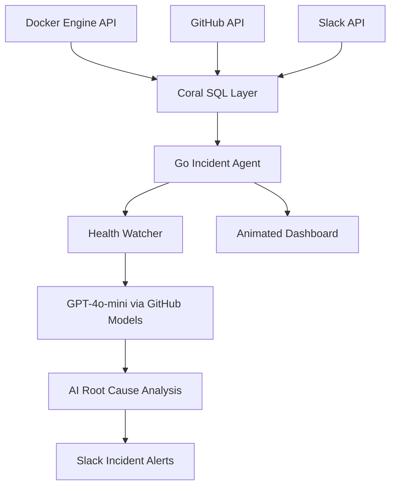

# 🏴‍☠️ CORAL WATCHDOG

### Autonomous AI Incident Intelligence for Modern Infrastructure

<div align="center">


[](https://go.dev/)
[](https://docker.com/)
[](https://github.com/withcoral/coral)
[]()
[](#license)

## 🚨 Detect. Correlate. Explain. Resolve.

### *A cinematic real-time DevOps command center powered by Coral SQL and AI.*

Coral Watchdog is an autonomous incident response platform that continuously watches your infrastructure, correlates failures with engineering activity, and generates AI-powered root cause analysis in seconds.

Unlike traditional monitoring systems, Coral Watchdog combines:

* 🐳 Docker runtime intelligence
* 🔗 GitHub engineering context
* 💬 Slack operational awareness
* 🧠 GPT-4o-mini incident reasoning
* ⚡ Coral SQL cross-source joins

—all inside one live animated dashboard.

---

# ✨ What Makes It Different?

Most monitoring tools only tell you **something failed.**

Coral Watchdog tells you:

* **what failed**
* **why it probably failed**
* **which PR likely caused it**
* **who deployed it**
* **which services are impacted**
* **how to fix it faster**

No ETL pipelines.
No custom ingestion layers.
No observability warehouse.

Just live operational intelligence.

---

# 🌌 The Dashboard Experience

## ⚡ Fully Animated Real-Time Command Center

Coral Watchdog includes a cinematic dashboard inspired by:

* Linear
* Vercel
* Datadog
* GitHub Pulse
* sci-fi command center UIs

### 🎥 Live Features

* Smooth animated metric cards
* Real-time incident stream
* Pulsing service health indicators
* Animated deployment timelines
* Live container heartbeat effects
* Auto-updating logs terminal
* AI incident feed with typing animations
* Dynamic charts + moving gradients
* Floating particle background effects
* Dark / light adaptive themes
* Zero page reloads

### 🧠 AI Incident Console

Every incident appears with:

* AI-generated root cause summary
* suspected deployment correlation
* impacted containers
* probable remediation steps
* incident severity scoring
* precise timestamps

---

# 🌟 The Star Query

```sql
SELECT
    dc.image,
    dc.status,
    dc.state,

    gp.title AS last_pr,
    gp.user__login AS author,

    sc.name AS slack_channel

FROM docker.containers dc

LEFT JOIN github.pulls gp
    ON gp.owner = 'your-org'
   AND gp.repo  = 'your-repo'

LEFT JOIN slack.channels sc
    ON 1=1

WHERE dc.state != 'running'

LIMIT 20;
```

This single query joins:

* Docker runtime failures
* GitHub pull request activity
* Slack communication systems

—in real time.

---

# 🏗️ Architecture



---

# 🖥️ Dashboard UI Vision

## 🧊 Glassmorphism + Motion UI

The frontend is designed as a premium motion dashboard using:

* animated glass cards
* soft neon glow effects
* blur-based panels
* dynamic gradients
* live charts
* smooth transitions
* responsive layouts
* microinteractions

### Suggested Frontend Upgrades

| Feature              | Tech                  |
| -------------------- | --------------------- |
| Animated charts      | Chart.js / ApexCharts |
| Fluid transitions    | Framer Motion         |
| Live sockets         | WebSockets            |
| Background particles | tsParticles           |
| Motion counters      | CountUp.js            |
| Glassmorphism        | CSS backdrop filters  |
| Terminal feed        | xterm.js              |

---

# 📊 Dashboard Sections

## 🏠 Overview

* infrastructure health score
* active incidents
* container uptime
* deployment velocity
* AI alert summaries

---

## 🐳 Containers

* live Docker container grid
* CPU + memory monitoring
* restart count tracking
* animated health pulses
* visual unhealthy indicators

---

## 🤖 AI Incidents

* GPT-4o-mini generated incident summaries
* severity tagging
* probable causes
* rollback recommendations
* incident timelines

---

## 💬 Live Query Console

Natural language → Coral SQL conversion.

Example:

```txt
show unhealthy containers related to latest PRs
```

Automatically translated into Coral SQL and executed live.

---

# 🛠️ Tech Stack

| Technology        | Purpose                   |
| ----------------- | ------------------------- |
| Go 1.22+          | Core backend engine       |
| Coral SQL         | Cross-source querying     |
| Docker Engine API | Infrastructure monitoring |
| GitHub API        | PR correlation            |
| Slack API         | Team alerts               |
| GPT-4o-mini       | AI reasoning engine       |
| HTML/CSS/JS       | Real-time frontend        |
| WebSockets        | Live dashboard updates    |

---

# 🚀 Future Vision

## Planned Features

* Kubernetes support
* OpenTelemetry traces
* distributed incident graphing
* auto-remediation workflows
* multi-cluster monitoring
* AI anomaly prediction
* Grafana integration
* GitHub Actions correlation
* live deployment replay
* AI copilots for debugging

---

# 🏆 Why This Project Matters

Modern infrastructure produces massive operational noise.

Coral Watchdog transforms that chaos into:

* actionable intelligence
* correlated incidents
* AI-assisted debugging
* real-time operational awareness

It is not just another monitoring dashboard.

It is an AI-powered operational command center.

---

# 📜 License

MIT License.

---

<div align="center">

## ⚓ Built during the Pirates of the Coral-bean Hackathon 2026

### Made with Coral SQL, AI, and controlled chaos.

# @ghosthouse7

</div>
